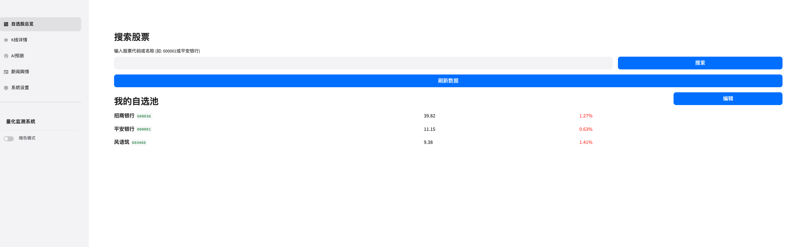
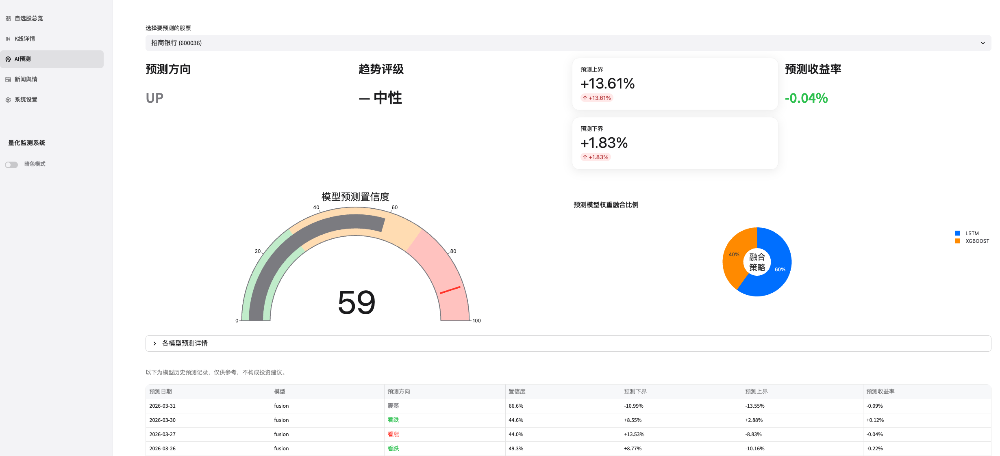

# Stock Monitor

一个面向 A 股场景的智能股票监控与 AI 预测项目，集成了实时行情采集、技术指标分析、新闻舆情、模型训练、告警通知，以及基于 FastAPI + Streamlit 的可视化界面。

## 功能概览

- 实时监控自选股行情与关键指标
- 计算常见技术指标并生成交易信号
- 聚合新闻并做金融情感分析
- 使用 LSTM / XGBoost 进行趋势预测
- 支持邮件与 Webhook 告警
- 提供 FastAPI 接口与 Streamlit 仪表盘

## 项目截图



## 技术栈

- 后端：FastAPI、SQLAlchemy、APScheduler
- 前端：Streamlit、Plotly
- 数据：AkShare、SQLite
- AI：PyTorch、XGBoost、Transformers
- 测试：Pytest、HTTPX

## 项目结构

```text
.
├── app/                # 后端核心代码
├── frontend/           # Streamlit 前端
├── tests/              # 自动化测试
├── requirements.txt    # Python 依赖
├── TECHNICAL_DOC.md    # 详细技术文档
└── .env.example        # 环境变量示例
```

## 快速开始

### 1. 安装依赖

建议使用 Python 3.11。

```bash
python3.11 -m venv .venv
source .venv/bin/activate
pip install --upgrade pip
pip install -r requirements.txt
```

### 2. 配置环境变量

复制示例配置并按需填写：

```bash
cp .env.example .env
```

> 注意：`.env` 只用于本地开发，不应提交到 GitHub。

### 3. 启动后端

```bash
uvicorn app.main:app --host 0.0.0.0 --port 8000 --reload
```

打开 <http://localhost:8000/docs> 可查看 API 文档。

### 4. 启动前端

```bash
streamlit run frontend/app.py
```

默认访问地址为 <http://localhost:8501>。

## 环境变量说明

关键配置见 `.env.example`，常用项包括：

- `DATABASE_URL`：数据库连接串
- `WATCH_LIST`：默认监控股票列表，逗号分隔
- `API_URL`：前端访问后端 API 的地址
- `ALERT_EMAIL_*`：邮件告警配置（可选）
- `ALERT_WEBHOOK_URL`：Webhook 告警地址（可选）
- `LLM_API_KEY` / `LLM_API_BASE_URL` / `LLM_MODEL_NAME`：LLM 备选情感分析配置（可选）

## 测试

```bash
pytest
```

## 作者声明
本人第一次开源项目，项目中存在许多不足，欢迎指正和 star 项目。

## 开源使用说明

- 不要提交 `.env`、数据库文件、模型权重、缓存和虚拟环境目录
- 默认仓库不包含训练产物与本地数据库
- 如果你要部署到公网，请优先使用环境变量或 GitHub Secrets 管理密钥

## 文档

更完整的技术说明、模块职责和运行细节见 [`TECHNICAL_DOC.md`](./TECHNICAL_DOC.md)。

## 参与贡献

欢迎提交 Issue 和 Pull Request。贡献流程见 [`CONTRIBUTING.md`](./CONTRIBUTING.md)。

## 安全

若发现安全问题，请参阅 [`SECURITY.md`](./SECURITY.md)。

## 许可证

本项目使用 [MIT License](./LICENSE)。
